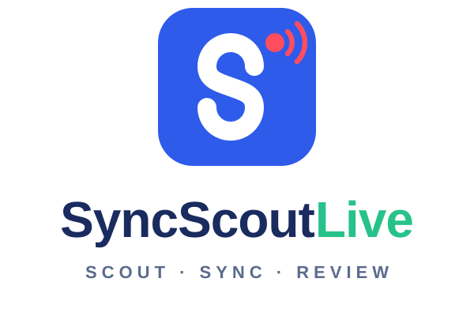

# SyncScout Live

<p align="center">
  
</p>

<p align="center">
  <b>試合会場で、タブレットひとつでライブスカウティング。</b>
</p>

<p align="center">
  
  
  
  
</p>

SyncScout Live は、バレーボールの試合をその場で記録するためのスカウティングアプリです。
iPad などのタブレットでの入力を前提に、ボタン中心の操作・日本語 UI・オフライン動作に対応しています。
記録した試合は DataVolley 互換の `.dvw` として書き出せるほか、YouTube 動画と時刻を合わせて SyncScout に送信できます。

- 公開 URL: https://courtendvb.github.io/SyncScout-live/
- バージョン: 0.1.0（OpenVolleyScout 0.16.1 ベース）

> [!NOTE]
> このリポジトリは [OpenVolleyScout](https://github.com/napo/openvolleyscout)（© Maurizio Napolitano / napo, AGPL-3.0）の改変版です。
> courtendvb が 2026-09-26 にフォークし、以降の変更はコミット履歴と下記「OpenVolleyScout からの主な変更点」にあります。
> ライセンスは元と同じく [AGPL-3.0](LICENSE) です。
>
> This is a modified version of OpenVolleyScout, licensed under AGPL-3.0.

## 使い方

### ブラウザで使う（インストール不要）

[公開 URL](https://courtendvb.github.io/SyncScout-live/) を Safari / Chrome などのブラウザで開くだけで使えます。

### ホーム画面に追加する（PWA）

iPad の Safari なら「共有」→「ホーム画面に追加」で、アプリのように起動できます。
一度開けばアプリ全体が端末に保存されるため、体育館などネットワークのない場所でも動作します。

新しいバージョンが公開されると「新しいバージョン」の案内が表示されます。
ラリーの途中で勝手に再読み込みされることはなく、「今すぐ更新」を押したときか、アプリを閉じたあとに更新されます。

### データの保存場所

チーム・試合・入力記録などのデータは、使っている端末のブラウザ内（IndexedDB）にだけ保存され、サーバーには送られません。
ブラウザのデータを消すと記録も消えるため、「データ」画面からこまめにバックアップ（`.ovs`）を書き出してください。
試合終了時とデータ画面にバックアップのリマインダーが表示されます。

例外は「SyncScout に送る」を使ったときで、このときだけ試合データが SyncScout（ログインしたチーム）に送られます。

## 主な機能

### ライブ入力

ライブ画面のヘッダーで、入力のレベルを 4 段階から選べます（端末ごとに記憶されます）。

| レベル | 内容 |
| --- | --- |
| **かんたん** | サーブを押し、ラリーが終わったら得点したチームを押すだけです。選手もスタメンも要りません。押した時刻から、SyncScout がラリーの部分だけを続けて再生できます。 |
| **タグ** | コート図の上に両チームの6人がローテーションどおりに並び、選手 → （スキル）→ 評価の順に押して記録します。次のチームやスキルはラリーの流れから推測されます。球種・ブロック枚数・コンビネーションも任意で付けられます（コースは記録しません）。動画を見ながらの入力にも使えます。 |
| **コート** | 大きなボタンに加えて、コート上をなぞってゾーンやコースを記録します。 |
| **詳細** | OpenVolleyScout 本来の DataVolley 形式の入力です（ボールの種類、ブロッカー、コンビネーションコール、コード直接入力）。 |

- 評価バーは タグ／コート では悪い順に `= / - ! + #` と並びます（`!` は `-` と `+` の中間）。詳細では DataVolley の元の順序のままです。
- 得点時には「どちらに・なぜ得点したか」を確認表示し、画面端のフラッシュと（任意で）確定音で入力を知らせます。
- タイムアウト・交代・得点修正・取り消しは大きなボタンで操作できます。取り消し履歴は試合ごとに保存され、再読み込み後も使えます。
- iPad の Safari がバックグラウンドのタブを再読み込みしても、最後に開いていた試合に戻ります。
- コートの縦向き・横向き切り替えや、コートサイドの入れ替えができます。
- スマートフォンでも入力できます。縦に持つとタグ入力と縦向きコート、横に持つと横向きコート（ツールバーはコートの右側）になり、ヘッダーもスマートフォン用のコンパクトな表示に切り替わります。

### 背番号だけで始められる名簿

- 選手名は任意です。名前のない選手は `#12` のように背番号で表示されます。
- `1-12 L13` のような書き方で、背番号をまとめて入力できます（チーム画面、試合設定、セット開始、交代）。
- 試合中に追加した選手は、試合の名簿とチームの両方に登録されます。あとからチーム画面で名前を入れると、保存済みの試合にも反映されます。
- 公式の名簿構成ルールは警告にとどめ、名簿が空でもスカウティングを始められます。
- 選手を登録せず、スタメンが空のままでもセットを始められます。タグ入力でサーブのときに背番号を選ぶと（番号ボタンを1回押すだけ）、その選手がチームに追加されて P1 に入ります。ほかのポジションも「＋」や「ベンチ・番号」ボタンから埋められ、ローテーションはそのまま正しく回ります。
- 大会名・会場は任意です（空欄なら「練習試合」）。セッターを選ばなくても開始できます。

### SyncScout への送信

試合終了画面または分析画面の「SyncScout に送る」から、試合データを YouTube 動画と組み合わせて SyncScout に登録できます。

- YouTube の URL と、最初のサーブの動画上の時刻を入れると、全プレーの時刻がそこに合わせて書き出されます（`?t=` 付きの共有リンクなら時刻は自動で入ります）。
- 動画を開いたまま入力したプレーは、その動画位置がそのまま使われます。
- 再生位置が早い・遅い場合は −15〜+15 秒の微調整ができます（端末ごとに記憶されます）。
- 送るときは、SyncScout と同じ **チームID と合言葉** でログインします（この端末に12時間保存）。試合はそのチームの試合として登録され、「SyncScout で開く」からビューアで開けます。
- SyncScout の接続先（Supabase の URL と公開キー）は、ビルド時に GitHub Actions の Variables `SYNCSCOUT_SUPABASE_URL`・`SYNCSCOUT_ANON_KEY` から組み込みます。未設定のビルドでは送信だけが使えません。

### OpenVolleyScout から引き継いだ機能

- チームと名簿の管理、JSON / CSV での名簿の読み込み・書き出し
- DataVolley `.dvw` の読み込み（プレビュー・診断つき）と書き出し
- 試合レポート（印刷・PNG・PDF）
- チーム・選手のダッシュボード、サイドアウト分析、ヒートマップ、レーダーチャート、傾向分析
- ローカル動画・YouTube と試合の同期、クリップの絞り込みと書き出し
- ライブ入力中の動画表示（ローカルファイル、YouTube、Web カメラ、RTSP）
- レセプション・ディフェンスシステムの編集
- `.ovs` 形式での試合・データベース全体のバックアップと同期

## OpenVolleyScout からの主な変更点

- **公開・配布**: GitHub Pages の公開パスを `/SyncScout-live/` に変更し、オフラインで動く PWA として配布
- **名前とアイコン**: SyncScout Live に変更。About ページと PDF には OpenVolleyScout をベースとして明記
- **言語**: 日本語 UI を追加して既定に。日本語・英語以外のロケールは削除
- **軽量化**: Tiebreak Tech `.db` の読み込み（sql.js）を削除し、分析・グラフ・設定などは必要になったときに読み込むように変更（初回読み込み 2.6 MB → 0.9 MB）
- **入力**: タッチ操作向けの入力（タグ／コート／詳細の 3 段階）、背番号中心の名簿
- **連携**: 動画時刻を合わせた `.dvw` 書き出しと SyncScout への送信
- **修正**: 日付をローカル時刻で扱うように修正（日本時間の午前 9 時前に前日の日付になる問題）、試合レポートで進行中のセットを勝敗に数えないように修正 など

詳しくは `git log` を参照してください。
[CHANGELOG.md](CHANGELOG.md) は OpenVolleyScout 0.16.1 までの履歴です。

## 技術スタック

- React 18 / TypeScript / Vite
- vite-plugin-pwa（Web 版のみ）
- Tauri 2（デスクトップ・Android 版のビルド用。OpenVolleyScout から引き継ぎ）
- React Router / Zustand
- Dexie / IndexedDB
- Recharts / simpleheat / pdfmake

## ローカル開発

```bash
npm install        # 依存関係のインストール
npm run dev        # 開発サーバーの起動
npm run build      # 本番ビルド
npm run preview    # 本番ビルドのプレビュー
npm test           # 検証スクリプトとテストの実行
```

`npm test` は、試合統計・ライブ入力フロー・DataVolley 書き出しの検証スクリプトと、ユニットテスト（node:test と Vitest）を実行します。

`main` ブランチに push すると、GitHub Actions（`.github/workflows/deploy.yml`）で GitHub Pages に公開されます。

## 画面（ルート）

ハッシュルーティングのため、URL は `#/...` の形になります。

| ルート | 画面 |
| --- | --- |
| `#/` | トップ |
| `#/teams` | チームと名簿の管理 |
| `#/match` | 試合設定 |
| `#/scouting` | ライブ入力 |
| `#/analysis` | 試合レポート、ダッシュボード、DataVolley 書き出し、動画分析、SyncScout 送信 |
| `#/team-analysis` | 複数試合のチーム分析 |
| `#/systems` | レセプション・ディフェンスシステムの編集 |
| `#/load-data` | 保存した試合の読み込み、バックアップ |
| `#/settings` | 言語、SyncScout 連携、ローカルデータの操作 |
| `#/about` | このアプリについて |

## ドキュメント

[docs/](docs/README.md) 以下の資料は OpenVolleyScout から引き継いだもの（英語）で、上記の変更点はまだ反映されていません。
アーキテクチャやデータモデルを調べるときの入口として使えます。

- [User Guide](docs/user-guide.md)
- [Architecture](docs/architecture.md)
- [Data Model](docs/data-model.md)
- [Persistence](docs/persistence.md)
- [Scouting Architecture](docs/scouting.md)
- [Code Structure](docs/code-structure.md)
- [Developer Guidelines](docs/developer-guidelines.md)

## ライセンスとクレジット

- SyncScout Live は [GNU Affero General Public License v3.0](LICENSE) で公開しています。
- ベース: [OpenVolleyScout](https://github.com/napo/openvolleyscout) © Maurizio Napolitano (napo)
